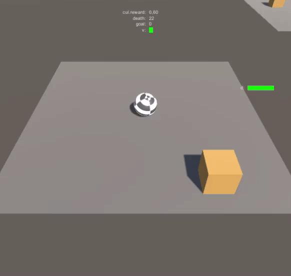
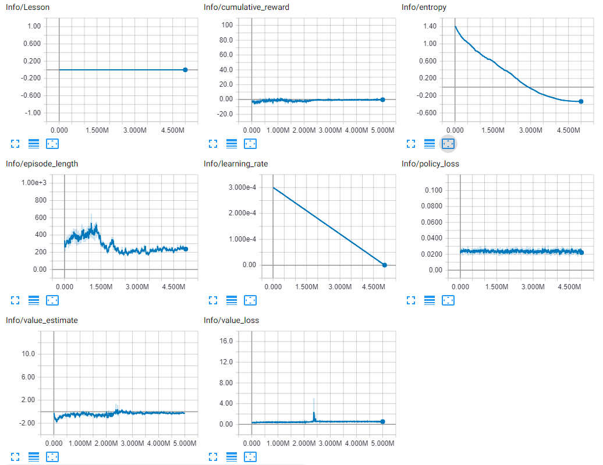
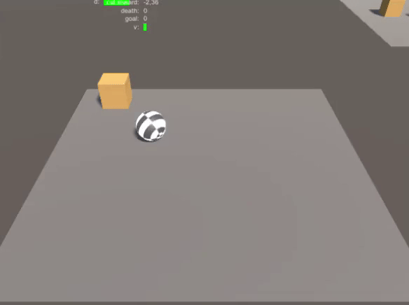
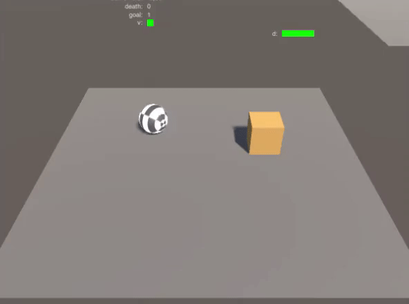
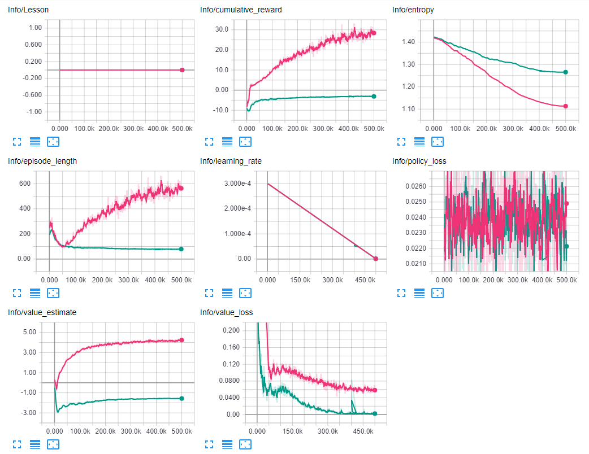

# Roller

This environment is based on [Making a New Learning Environment](https://github.com/Unity-Technologies/ml-agents/blob/master/docs/Learning-Environment-Create-New.md). A simple Roll-a-Ball game where the objective is to collect a box by controlling a ball. The player should avoid falling off the edge.

In order to speed up the training, I created 20 copies of the environment in the same scene with a script. This allows learning from 21 agents simultaneously each frame during training. [Check out the script here.](../RL-unity-env/Assets/Shared/Scripts/EnvironmentCloner.cs)

## First Attempt

As a starting point, I used the unmodified environment from the Unity tutorial and trained the agent for over 18 hours.

### Training Config

Two parameters where overridden for this experiment. The `max_steps` where increased to 5.0e6 to train for a much longer time. Additionally `beta` was reduced to 5.0e-4 to ensure the entropy going down over time.

```
RollerBrain:
    max_steps: 5.0e6
    beta: 5.0e-4

default:
    trainer: ppo
    batch_size: 1024
    beta: 5.0e-3
    buffer_size: 10240
    epsilon: 0.2
    gamma: 0.99
    hidden_units: 128
    lambd: 0.95
    learning_rate: 3.0e-4
    max_steps: 5.0e4
    memory_size: 256
    normalize: false
    num_epoch: 3
    num_layers: 2
    time_horizon: 64
    sequence_length: 64
    summary_freq: 1000
    use_recurrent: false
    use_curiosity: false
    curiosity_strength: 0.01
    curiosity_enc_size: 128
```

### Reward Function

The agent receives a reward of +1 for collecting the goal and -1 for falling off the platform. Additionally, he is rewarded +0.1 for every frame he gets closer to target (box) and received a time penalty of -0.05 each frame.

### Results

The agent learned to kill itself quickly to avoid accumulating negative rewards.





## Next Attempt

Turns out there was a bug in `RollerAgent.CollectObservations()`. I mixed up the 2nd axis of y and z:
```
// Observe target position
AddVectorObs(relativePos.x / plattformBounds);
AddVectorObs(relativePos.y / plattformBounds);
```
Should have been:
```
// Observe target position
AddVectorObs(relativePos.x / plattformBounds);
AddVectorObs(relativePos.z / plattformBounds);
```
Other observations where also affected. So the agent never obsevered the z-distance. This explains why he failed to collect boxes that where moved in z and decides to suicide instead.

So retrain after the fix for 2h this time.

### Config

```
RollerBrain:
    max_steps: 5.0e5
```

### Results



The agent now collects the boxes correctly, but he moves very slowly towards them. Let's tackle this next.

## Final Attempt

My theory for the slow movement of the agent is as follows: The given reward function rewards each frame with +0.1 where the ball gets closer to the target while getting a time penalty of -0.05. This makes a total reward of +0.05 each frame he is moving towards the target. In order to maximise rewards, it learned to maximise the amount of frame it is moving towards the goal since more frames moving towards = move reward. So the ideal policy with the reward function is collecting the targets slowly.

To fix this I reduced the reward for proximity to +0.04. Now the total reward for a frame moving towards the target is-0.01. This is still better than moving anywhere else (-0.05) to accelerate learning, but he is no longer rewarded for stretching the approach over many frames. 

The config remains unchanged.

### Results



Looks like the change to the reward function did the trick and he learned to collect the rewards quickly now.



The magenta graph is from the training after the fix, the turquoise graph shows the final training session.

The cumulative rewards for the fixed training are much higher, as expected since the agent got higher rewards for approaching the target. With the high approaching reward, it did not flatten out, which indicated that an even slower policy might have been better with this rewards function.

The episode length is much lower for final training which fits the fact that the agent now collects the box as fast as possible.

Analogue to the cumulative reward the value estimate is much lower in the final training.

Interestingly the value loss is lower for the final training. This means the estimated value is much more accurate. So the agent was more effective learning the new reward function. 