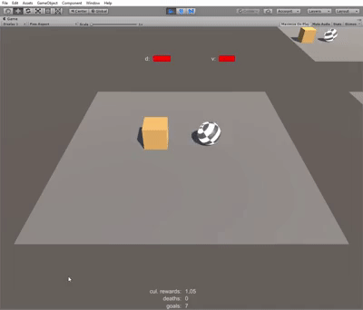

# Roller1D

This is simplified version of Unity's [Making a New Learning Environment](https://github.com/Unity-Technologies/ml-agents/blob/master/docs/Learning-Environment-Create-New.md) tutorial.

## Controls

The ball (agent) can roll left or right on the x-axis. It uses force on the rigidbody to move the ball. So the agent has to deal with lateship.

## Rewards & Objective

The goal of the agent is to collect the box by rolling into it. This is rewarded with +1. Further more falling off the edge is to be avoided and gets punished with -1.

Additionally the environment rewards the agent for rolling towards the box by +0.1 per frame, where the distance gets smaller. Finally there is penalty for the time it takes by -0.05 per frame.

## Training Config

The agent was trained for 50.000 steps with the default config:

```
default:
    trainer: ppo
    batch_size: 1024
    beta: 5.0e-3
    buffer_size: 10240
    epsilon: 0.2
    gamma: 0.99
    hidden_units: 128
    lambd: 0.95
    learning_rate: 3.0e-4
    max_steps: 5.0e4
    memory_size: 256
    normalize: false
    num_epoch: 3
    num_layers: 2
    time_horizon: 64
    sequence_length: 64
    summary_freq: 1000
    use_recurrent: false
    use_curiosity: false
    curiosity_strength: 0.01
    curiosity_enc_size: 128
```

## Result

The agent learned to avoid falling completly and collectes the boxes one by one reliable.

